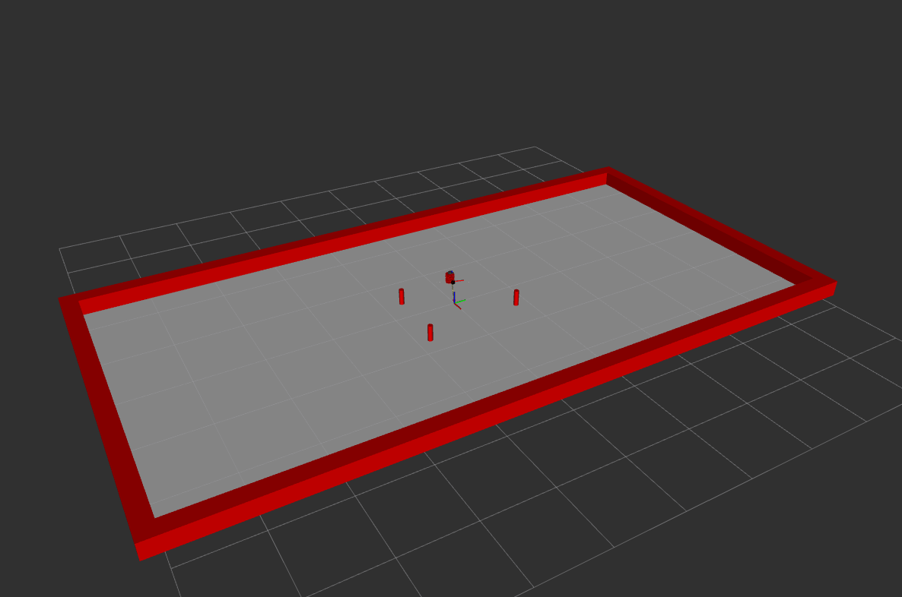

# Nusim  Description

## Launching the Simulator

The package includes a launch file to start the simulator with RViz:

* `launch nusim nusim.launch.xml color:=basic_world` to see the robot in rviz with the walls and obstacles.
* `ros2 service call /nusimulator/reset std_srvs/srv/Empty` to reset the turtle simulation.
* `ros2 param set /nusimulator x0 5.0` to change the position parameters of the turtlesim.

### 1. Simulation Node (`nusimulator`)

- Implements a main loop at a configurable `rate` (default 100 Hz)
- Publishes `~/timestep` (`std_msgs/msg/UInt64`) for tracking simulation steps
- Provides a `~/reset` service (`std_srvs/srv/Empty`) to reset simulation state, including robot pose.

### 2. Simulated Robot

- Simulates a Ground Truth TurtleBot3 robot (`red` namespace)
- Publishes transform between `nusim/world` and `red/base_footprint`
- Initial robot pose is configurable via parameters:
  - `x0`, `y0`, `theta0` (defaults to 0.0)

### 3. Arena Walls

- Rectangular arena with walls (Default: height 0.25 m)
- Configurable arena size via parameters:
  - `arena_x_length`
  - `arena_y_length`
- Walls are red and published as `visualization_msgs/MarkerArray` on `~/real_walls`

### 4. Cylindrical Obstacles

- Supports multiple obstacles specified by parameters:
  - `obstacles.x` (list of x coordinates)
  - `obstacles.y` (list of y coordinates)
  - `obstacles.r` (list of obstacle radi)
- Obstacles are red and published as `visualization_msgs/MarkerArray` on `~/real_obstacles`
