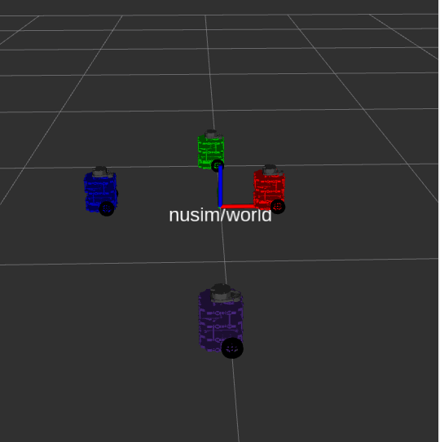

# Nuturtle  Description
URDF files for Nuturtle - NCK
* `launch nuturtle_description load_one.launch.xml color:=red` to see the robot in rviz.
* `ros2 launch nuturtle_description load_all.launch.xml` to see four copies of the robot in rviz.

* The rqt_graph when all four robots are visualized (Nodes Only, Hiden Debug) is:

# Launch File Details
* To show the Arguements of the single bot launch file, run: `ros2 launch nuturtle_description load_one.launch.xml --show-args`

  Output: Arguments (pass arguments as `<name>:=<value>`):

    `use_rviz`:
        The user can control whether the turtlebot3 is shown in Rviz or not at launch.
        (default: `true`)

    `use_jsp`:
        The joint state publisher can be true or false. If true, the joint state publisher will launch default joint states
        (default: `true`)

    `color`:
        Set the base_Link color of the robot. Valid choices are: [`purple`, `red`, `green`, `blue`]
        (default: `purple`)`
* To show the Arguements of all-bot launch file, run: `ros2 launch nuturtle_description load_all.launch.xml --show-args`

  Output: Arguments (pass arguments as `<name>:=<value>`):

    `use_rviz`:
        The user can control whether the turtlebot3 is shown in Rviz or not at launch.
        (default: `true`)

    `use_jsp`:
        The joint state publisher can be true or false. If true, the joint state publisher will launch default joint states
        (default: `true`)

    `color`:
        Set the base_Link color of the robot. Valid choices are: [`purple`, `red`, `green`, `blue`]
        (default: `purple`)`